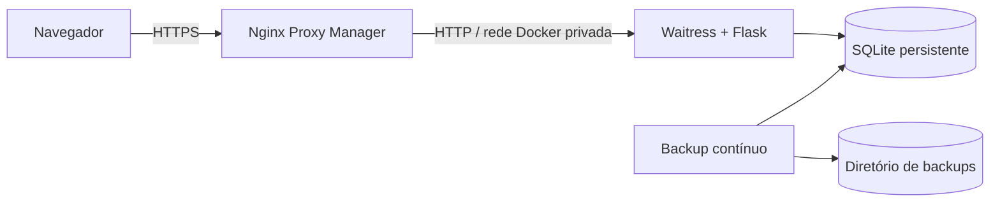

# Arquitetura

## Visão geral

O Ojuara é uma aplicação monolítica Flask, renderizada no servidor, com banco
SQLite local. Não depende de serviços externos para suas regras de negócio.

## Componentes

- `servidor_producao.py`: inicia Waitress com quatro threads.
- `app/__init__.py`: factory Flask, blueprints, ProxyFix e cabeçalhos de segurança.
- `app/routes/`: camada HTTP; interpreta requisições e aplica permissões.
- `app/services.py`: transações e regras de negócio.
- `app/db.py`: conexão SQLite por requisição, schema e migrações incrementais.
- `app/templates/` e `app/static/`: Jinja, CSS e JavaScript sem bundler.
- `scripts/backup_continuo.py`: agenda cópias consistentes do SQLite.

## Ambientes

| Item | Desenvolvimento remoto | Produção |
|---|---|---|
| Branch | `desenvolvimento` | `producao` |
| Stack | `ojuara-dev` | `ojuara-producao` |
| Aplicação | `ojuara-dev` | `ojuara-producao` |
| Dados | `/opt/ojuara-dev/data` | `/opt/ojuara-producao/data` |
| Backups | `/opt/ojuara-dev/backups` | `/opt/ojuara-producao/backups` |
| Domínio | `ojuara-dev.outboxtech.com.br` | `ojuara.outboxtech.com.br` |

Os ambientes não compartilham imagem nomeada, container, banco, backup ou
segredo. Ambos podem escutar na porta interna `5000`, pois possuem IPs Docker
distintos. A porta não é publicada no host.

## Modelo e invariantes

- Produto é a variante `(codigo_fabricante, tamanho, cor)`.
- Estoque só muda por movimentação vinculada a Nota Fiscal.
- Uma sacola retira itens de uma NF de entrada ativa.
- Uma venda nova consome itens da sacola do vendedor; não baixa estoque duas vezes.
- Operações em lote são transacionais: qualquer erro impede o lote inteiro.
- Permissões são aplicadas no servidor por `@requer`; ocultar UI não é controle.

O DDL completo está em `app/schema.sql`. Colunas novas em tabelas existentes
também precisam ser cadastradas em `MIGRACOES_COLUNAS`, em `app/db.py`.

## Disponibilidade e escala

SQLite exige uma única réplica da aplicação. O desenho prioriza simplicidade
para uma loja local; não é apropriado para múltiplas réplicas ou escrita
distribuída sem migrar o banco e revisar as transações.
